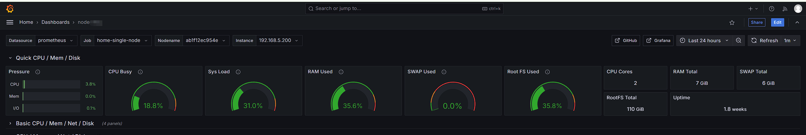
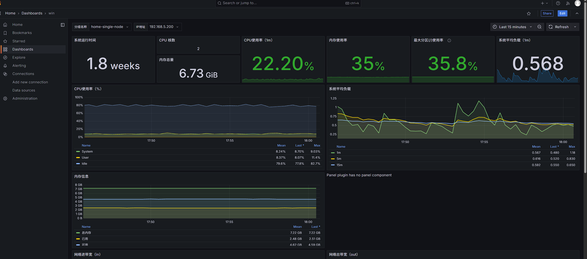

## 2. Linux 主节点部署

### 步骤 1：准备工作目录与配置文件

创建并进入指定的工作目录：

```bash
mkdir -p /home/dog/scripts/promethus
cd /home/dog/scripts/promethus
```

在该目录下创建 `docker-compose.yml` 文件：

```yaml
services:
  prometheus:
    image: [swr.cn-north-4.myhuaweicloud.com/ddn-k8s/quay.io/prometheus/prometheus:v3.5.0](https://swr.cn-north-4.myhuaweicloud.com/ddn-k8s/quay.io/prometheus/prometheus:v3.5.0)
    container_name: prometheus
    restart: always
    ports:
      - "9090:9090"
    volumes:
      - ./prometheus.yml:/etc/prometheus/prometheus.yml
      - prometheus_data:/prometheus

  grafana:
    image: docker.1ms.run/grafana/grafana:13.0.6
    container_name: grafana
    restart: always
    ports:
      - "3001:3000"  #这里3000跟我的环境冲突了，把原来的3000更改为3001
    volumes:
      - grafana_data:/var/lib/grafana

  node-exporter:
    image: [swr.cn-north-4.myhuaweicloud.com/ddn-k8s/docker.io/prom/node-exporter:v1.8.1](https://swr.cn-north-4.myhuaweicloud.com/ddn-k8s/docker.io/prom/node-exporter:v1.8.1)
    container_name: node-exporter
    restart: always
    ports:
      - "9100:9100"
    volumes:
      - /proc:/host/proc:ro
      - /sys:/host/sys:ro
      - /:/rootfs:ro
    command:
      - '--path.procfs=/host/proc'
      - '--path.sysfs=/host/sys'
      - '--path.rootfs=/rootfs'

volumes:
  prometheus_data:
  grafana_data:

```

在同一目录下创建基础 `prometheus.yml` 配置文件：

```yaml
global:
  scrape_interval: 15s

scrape_configs:
  - job_name: 'home-single-node'
    static_configs:
      - targets:
          - 'node-exporter:9100'
        labels:
          env: 'home'
          instance: '192.168.5.200'

```

启动服务：

``` 
docker compose up -d
```

---

### 步骤 2：配置 Grafana 数据源与看板

1. **登录 Grafana**：
打开浏览器访问 `http://192.168.5.200:3001`（默认账号：`admin`，默认密码：`admin`）。
2. **添加 Prometheus 数据源**：
导航至 **Connections** -> **Data sources** -> 点击 **Add data source** -> 选择 **Prometheus**。
* **URL**：填入 `http://prometheus:9090` 或 `http://192.168.5.200:9090`。
* 点击 **Save & test**。


3. **导入 Linux 监控看板**：
* 点击右上角 **+** -> **Import dashboard**。
* 输入社区看板 ID **`1860`**，点击 **Load**。
* 数据源选择刚创建的 Prometheus，点击 **Import** 完成导入。


---

## 3. 接入 Windows 节点监控

### 步骤 1：安装 `windows_exporter`

1. **下载安装包**：
前往 [windows_exporter Releases](https://github.com/prometheus-community/windows_exporter/releases) 下载 `.msi` 安装包。
2. **安装并运行**：
运行 `.msi` 程序，安装完成后会自动注册为 Windows 系统服务并随机启动。
3. **验证服务**：
在 Windows 本地访问 `http://localhost:9182/metrics`，若有文本指标输出则说明启动成功（默认端口：`9182`）。

> **注意：** 请确保 Windows 防火墙已允许 TCP `9182` 端口的入站访问。

---

### 步骤 2：更新 Prometheus 配置

编辑 `/home/dog/scripts/promethus/prometheus.yml`：

```yaml
global:
  scrape_interval: 15s

scrape_configs:
  - job_name: 'home-single-node'
    static_configs:
      - targets:
          - 'node-exporter:9100'
        labels:
          env: 'home'
          instance: '192.168.5.200'

  # 新增 Windows 节点监控
  - job_name: 'windows-nodes'
    static_configs:
      - targets:
          - '192.168.5.100:9182' # 替换为实际 Windows 节点 IP
        labels:
          env: 'home'
          os: 'windows'

```

重启 Prometheus 使配置生效：

```
docker restart prometheus

```

---

### 步骤 3：导入 Windows 专属看板

1. 打开 Grafana 界面（`http://192.168.5.200:3001`）。
2. 点击 **+** -> **Import dashboard**。
3. 输入 Windows 仪表盘 ID **`9276`**，点击 **Load**。
4. 选择对应的 Prometheus 数据源，点击 **Import**。

---

## 4. 总结与落地效果

完成以上步骤后，所有监控数据将持久化在 Docker 卷中。可以在 Grafana 统一视图中实时监测 Linux 与 Windows 节点的 CPU、内存、磁盘及网络流量情况。

