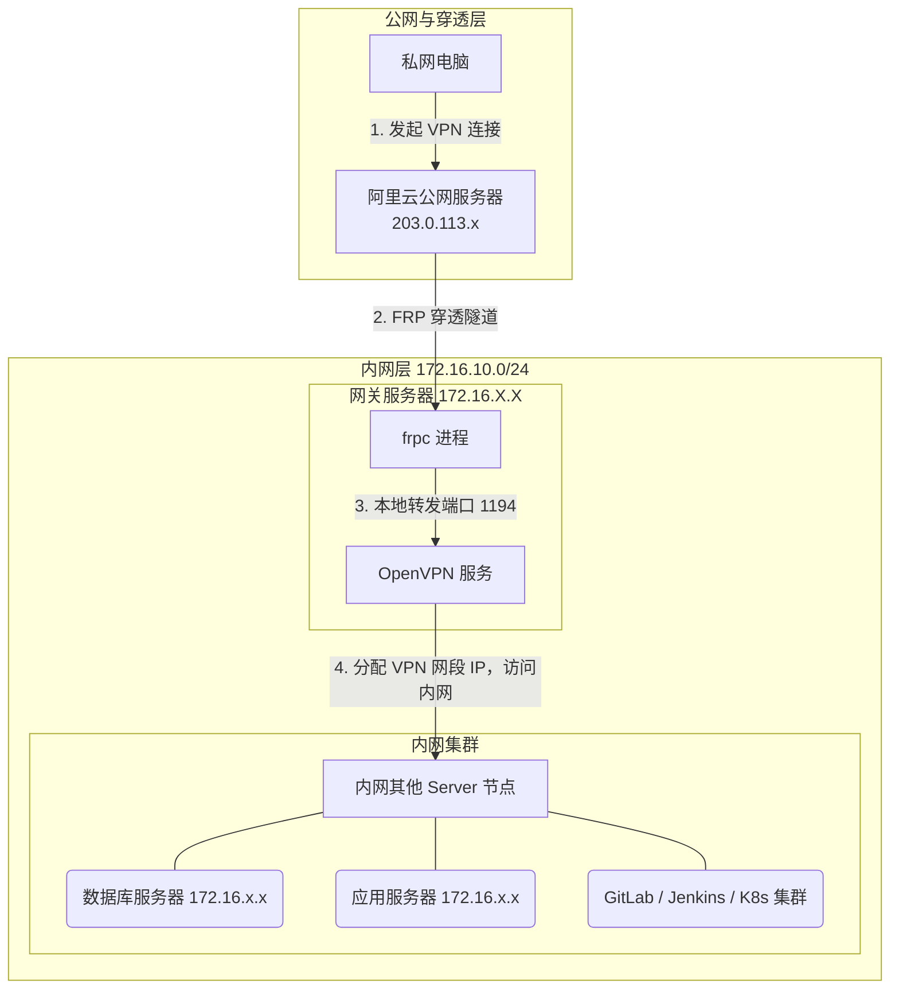
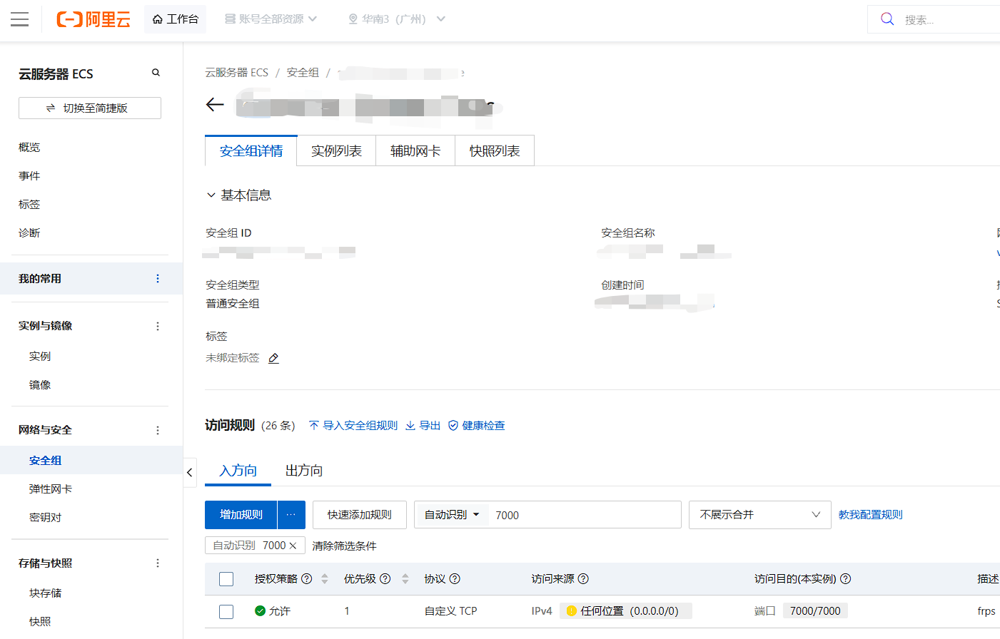
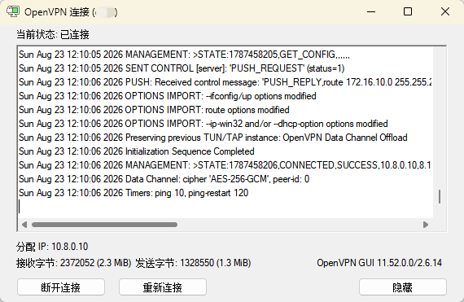

+++
title = 'FRP 内网穿透实现 OpenVPN 异地组网'
date = 2026-08-23T00:09:08+08:00
draft = false
+++


### 概要

本文整理了通过 FRP 内网穿透实现 OpenVPN 异地组网的全套配置文件。包含服务端（frps）、客户端（frpc）、OpenVPN 服务端（server.conf）及 OpenVPN 客户端（client.ovpn）的配置示例。

---

### 基于 FRP + OpenVPN 实现内网穿透与跨网段访问配置指南 

为了将局域网内部的 OpenVPN 服务暴露至公网，可以通过配置 FRP 隧道（TCP 协议）实现流量转发：

***网络架构逻辑与流量走向图***



**1. 公网服务端 FRP 配置 (frps.toml)**

```toml
[common]
bind_port = 7000
vhost_https_port = 8443
# vhost_http_port = 8080
token = "123456"

[openvpn]
type = tcp
port = 1194

```
***ECS安全组配置***


**2. 内网局域网节点 FRP 客户端配置 (frpc.toml)**

```toml
[common]
server_addr = "x.x.x.x"  # 替换为您的公网服务器IP
server_port = 7000
token = "123456"

# OpenVPN 穿透配置
[openvpn]
type = "tcp"
local_ip = "127.0.0.1"
local_port = 1194
remote_port = 1194

# Zabbix 监控穿透配置
[zabbix]
type = "tcp"
local_ip = "172.16.10.200"
local_port = 80
remote_port = 8888

```

**3. 内网 OpenVPN 服务端配置 (/etc/openvpn/server.conf)**

```ini
# 监听端口与传输协议
port 1194
proto tcp
dev tun

# 证书与密钥路径
ca ca.crt
cert server.crt
key server.key
dh dh.pem

# VPN 客户端地址池与路由推送
server 10.8.0.0 255.255.255.0
push "route 172.16.10.0 255.255.255.0"
push "dhcp-option DNS 8.8.8.8"

# 连接控制与维持
ifconfig-pool-persist ipp.txt
keepalive 10 120
max-clients 100
client-to-client
persist-key
persist-tun

# 安全与日志记录
tls-auth /etc/openvpn/ta.key 0
verb 3
status openvpn-status.log
log /var/log/openvpn.log

```

**4. 远端 OpenVPN 客户端配置 (client.ovpn)**

```ini
# 指定当前运行模式为客户端
client
dev tun
proto tcp

# 填写公网服务器IP及FRP映射的远程端口
remote x.x.x.x 1194

# 网络连接与恢复策略
resolv-retry infinite
nobind
persist-key
persist-tun

# 证书与安全配置
ca ca.crt
cert cebc.crt
key cebc.key
tls-auth ta.key 1

# 日志输出级别
verb 3

```
***OpenVPN GUI连接情况***


---

针对官方最新版本或技术细节，可参考：

* [FRP 官方文档](https://github.com/fatedier/frp)
* [OpenVPN 官方文档](https://openvpn.net/community-resources/)
* 