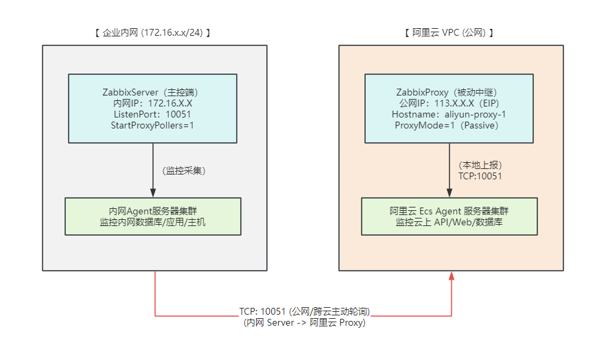
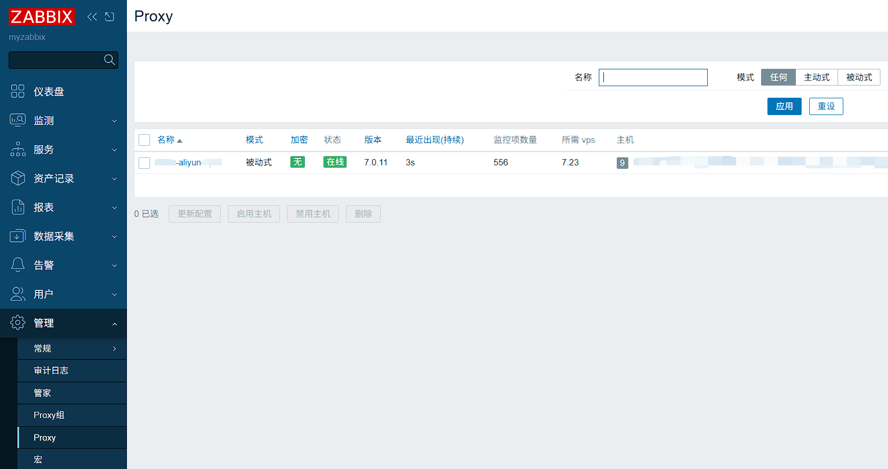

+++
title = '企业级 Zabbix 混合云监控架构实战：内网主控 + 阿里云 Proxy 被动中继'
date = 2026-08-29T22:45:00+08:00
draft = false
tags = ["Zabbix", "DevOps", "混合云", "监控架构"]
categories = ["运维实战"]
+++

在企业实际运维场景中，业务往往分布在本地自建机房（内网）和公有云（如阿里云）之间。为实现集中监控，本文记录一种典型的 **Zabbix 混合云监控架构**——基于 **Zabbix Proxy 被动中继** 模式，实现跨网络的安全采集。

---

## 1. 整体架构设计与流程

系统采用 **被动模式（Passive Proxy）** 架构。阿里云侧的 Proxy 不主动穿透内网，而是由内网的 Zabbix Server 按照调度周期主动向公网 Proxy 发起请求抓取监控数据。

[Zabbix 混合云监控架构拓扑图]


### 核心流转逻辑：
1. **云内采集**：阿里云 ECS Agent 节点将监控指标提交至同 VPC 内的 Zabbix Proxy（端口 `10051`）。
2. **跨云传输**：内网 Zabbix Server 主动连接阿里云 Proxy 的公网 IP（端口 `10051`）轮询获取数据。
3. **本地监控**：内网 Agent 节点直接由内网 Zabbix Server 抓取，不经过跨云链路。

---

## 2. 核心服务脱敏配置

以下为生产环境实际运行配置（关键 IP、域名及凭证均已做脱敏处理）。

### 2.1 内网主控端配置（Zabbix Server）

配置文件路径：`/etc/zabbix/zabbix_server.conf`

```ini
LogFile=/var/log/zabbix/zabbix_server.log
LogFileSize=0
PidFile=/run/zabbix/zabbix_server.pid
SocketDir=/run/zabbix

# 数据库配置
DBName=zabbix
DBUser=zabbix
DBPassword=<YOUR_DB_PASSWORD>

# 监听与轮询配置
ListenPort=10051
ListenIP=0.0.0.0
StartProxyPollers=1        # 启用 Proxy 轮询线程（关键）

# 性能与日志
SNMPTrapperFile=/var/log/snmptrap/snmptrap.log
Timeout=4
LogSlowQueries=3000
StatsAllowedIP=127.0.0.1
EnableGlobalScripts=0
```


### 2.2 阿里云中继端配置（Zabbix Proxy）
配置文件路径：/etc/zabbix/zabbix_proxy.conf
```
# 被动模式配置
ProxyMode=1                # 1 代表被动模式 (Passive Proxy)
Server=<INTERNAL_SERVER_IP> # 允许访问此 Proxy 的内网 Server 来源地址/出口 IP
Hostname=aliyun-proxy-01   # Proxy 唯一标识名称

LogFile=/var/log/zabbix/zabbix_proxy.log
LogFileSize=0
PidFile=/run/zabbix/zabbix_proxy.pid
SocketDir=/run/zabbix

# 本地数据库配置
DBHost=localhost
DBName=zabbix_proxy
DBUser=zabbix
DBPassword=<YOUR_DB_PASSWORD>

# 离线数据缓存
ProxyOfflineBuffer=6       # 离线数据在本地保留 6 小时
ProxyBufferMode=hybrid
ProxyMemoryBufferSize=16M  # 内存缓存大小

# 工具与性能配置
SNMPTrapperFile=/var/log/snmptrap/snmptrap.log
Timeout=4
FpingLocation=/usr/bin/fping
Fping6Location=/usr/bin/fping6
LogSlowQueries=3000
StatsAllowedIP=127.0.0.1
```

## 3. 控制台联通性验证 

配置完成后，登录内网 Zabbix Server 的 Web 控制台，依次点击 **管理 (Administration) -> Proxies**。如果配置成功，可以看到阿里云 Proxy 节点状态正常（最后一次连接时间会在数秒内更新）：

[Zabbix Proxy 状态图]


在添加阿里云 ECS 主机监控时，只需在主机的 **Monitored by proxy** 选项中选择 `aliyun-proxy-01` 即可完成绑定。

---

## 4. 架构优势总结 

* **安全性高（防穿透）**：采用被动模式（Passive Proxy），内网 Server 主动去连公网 Proxy 拿数据，无需将内网 Server 暴露给公网，也不需要在防火墙上开入站映射。
* **节省带宽与连接数**：阿里云上的数十台 ECS 只需要将数据发给同 VPC 内的 Proxy，再由 Proxy 压缩后一次性传给 Server，极大地降低了跨云公网流量开销。
* **具备断网缓存能力**：公网链路波动时，Proxy 会自动把数据缓存在本地（配置中设置了 `ProxyMemoryBufferSize`），网络恢复后再补发给 Server，数据不会丢失。